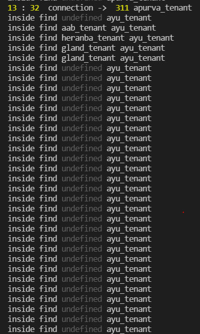

## Description

Nest framework TypeScript starter repository with MongoDB, GraphQL integration and multi-tenancy architecture.

## Installation

```bash
$ npm install
```

## Running the app

```bash
# development
$ npm run start

# watch mode
$ npm run start:dev

# production mode
$ npm run start:prod
```

## Multi Tenant Database Connectivity 
```bash
Pass Database Name in HTTP Headers

{
  "database": "<tenant_name>"
}

```

## Problem We Are Facing

1. In multi-tenancy mode, for each request a new database connection is being created when more requests are coming in less time.

2. Old DB connection in mongoose.connections are getting undefined.
 
3. Old DB connection is not being reused.

4. Mongo Atlas Connection count increasing due to above behaviour.


## Old DB Connection Undfined Error Screnshot


